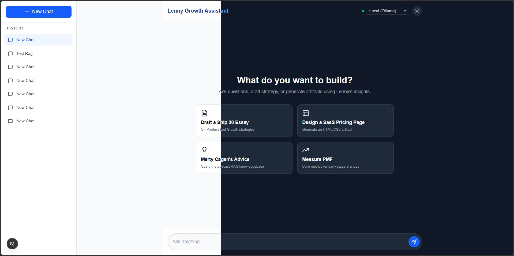
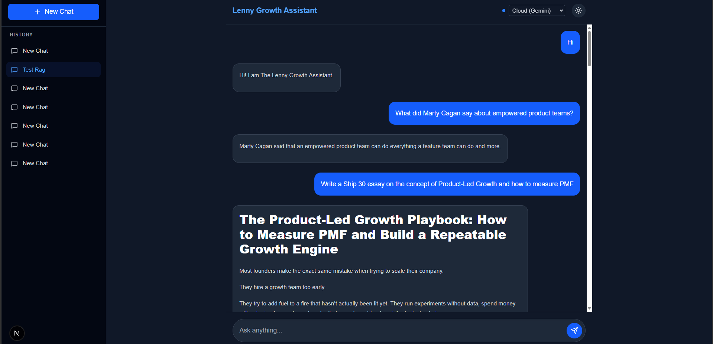
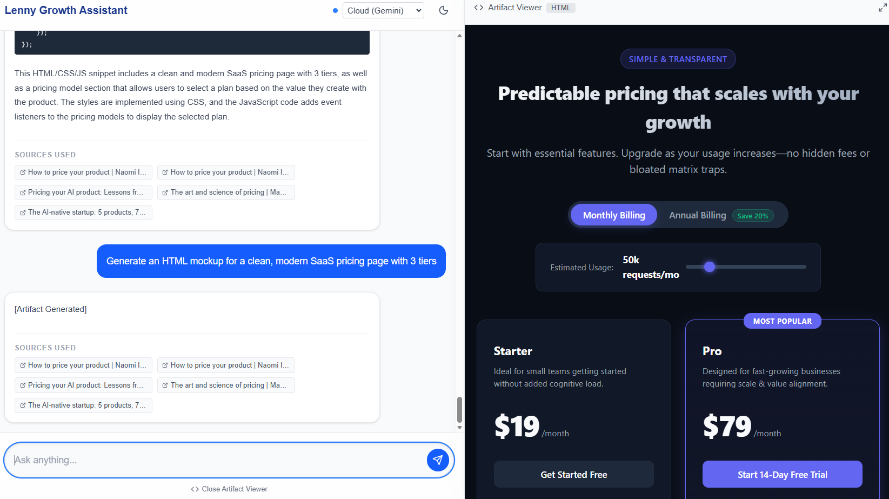

# The Lenny Growth Assistant

A grounded AI workspace for turning Lenny's Podcast conversations into product and growth answers, reusable writing, and rendered artifacts.

> **Take-home context:** This project was built as a small forward-deployment engagement: take an ambiguous internal knowledge problem, turn it into a usable product, make the trade-offs explicit, and leave behind something another engineer can actually run.



## The problem → the method → the outcome

### The problem
Product and growth teams have hours of podcast knowledge available, but finding the right idea at the right moment is slow. A useful assistant needs to do more than generate plausible PM advice: it needs to retrieve relevant source material, preserve conversational context, show where an answer came from, and turn that knowledge into something reusable.

The operational constraint matters too. A reviewer should be able to run the system locally, including the mandatory Ollama demo, without depending on a private machine containing the transcript corpus.

### The method
I built the product as a small full-stack RAG system:

1. **Acquire the transcript corpus** outside the application repo and mount it into the ingestion container.
2. **Parse and chunk transcripts**, generate embeddings with `nomic-embed-text`, and store vectors in PostgreSQL + pgvector.
3. **Retrieve relevant transcript chunks** for each question and pass only that context to the selected LLM provider.
4. **Route requests by skill**: grounded Q&A, Ship 30 for 30 essay generation, or artifact generation.
5. **Persist sessions, messages, and artifacts** so the workflow survives refreshes and can be inspected later.
6. **Render generated artifacts in-app** inside a sandboxed iframe rather than asking the user to copy code into another tool.
7. **Keep the model boundary explicit**: Ollama for the local demo, with optional Anthropic and Gemini cloud providers.

### The outcome
The result is a single chat workflow where a user can ask a product question, trace the response back to transcript sources, turn the answer into a structured essay, or generate a live HTML artifact without leaving the application.

The most important engineering outcome is reproducibility: the transcript dependency is now documented and fetchable instead of being an implicit file that only existed on the developer's machine. That turns the core RAG path from “works on my machine” into a handoff another engineer can follow.

## Demo

**2–3 minute walkthrough:** urlYouTube demo playlisthttps://youtube.com/playlist?list=PLPP3E0ihdblc&si=jZA87H7PTDMOezQD

The walkthrough covers the product, local Ollama flow, retrieval experience, artifact viewer, and a key implementation trade-off.

## Screenshots

| Chat with RAG Citations | Artifact Viewer |
|---|---|
|  |  |

## Tech Stack

| Layer | Technology |
|---|---|
| Frontend | Next.js 16, React 19, Tailwind CSS v4 |
| Backend | FastAPI, SQLAlchemy, Pydantic |
| Database | PostgreSQL + pgvector |
| Embeddings | `nomic-embed-text` via Ollama |
| Local LLM | `llama3.2:1b` via Ollama |
| Cloud LLM | Anthropic, Gemini (optional) |
| Infra | Docker Compose |

## Features

- **Grounded RAG** — semantic retrieval over the indexed transcript corpus with source metadata returned to the UI.
- **Multi-provider LLM routing** — switch between local Ollama, Gemini, or Anthropic from the UI dropdown.
- **Ship 30 for 30 essay generation** — structured long-form writing grounded in retrieved podcast context.
- **HTML artifact generation** — renders live HTML/CSS previews in a sandboxed iframe.
- **Session persistence** — chat history and artifacts are stored in PostgreSQL and survive page refreshes.
- **Inline session rename** — rename conversations directly from the sidebar.
- **Dark / light mode** — explicit UI toggle.
- **Markdown rendering** — assistant responses are rendered as formatted Markdown.

## Project Structure

```text
lenny-growth-assistant/
├── docker-compose.yml
├── .env.example
├── Makefile
├── LICENSE
├── data/
│   └── README.md                    # Transcript dependency + acquisition instructions
├── scripts/
│   └── fetch_transcripts.sh         # Fetch/update the external transcript corpus
│
├── backend/
│   ├── Dockerfile
│   ├── requirements.txt
│   ├── app/
│   │   ├── main.py                  # FastAPI app entrypoint
│   │   ├── api/
│   │   │   └── endpoints.py         # Sessions, messages, and health routes
│   │   ├── agents/
│   │   │   ├── router.py            # Skill + provider routing
│   │   │   ├── llm_client.py        # Ollama client
│   │   │   ├── gemini_client.py     # Gemini client
│   │   │   └── anthropic_client.py  # Anthropic client
│   │   ├── core/
│   │   │   └── database.py          # SQLAlchemy engine + session
│   │   ├── models/
│   │   │   └── domain.py            # ORM models
│   │   └── services/
│   │       └── rag.py               # Chunking, embeddings, retrieval
│   ├── scripts/
│   │   └── ingest_transcripts.py    # Transcript ingestion pipeline
│   └── tests/
│       ├── test_api.py
│       └── ui_test_plan.md
│
├── frontend/
│   ├── Dockerfile
│   ├── package.json
│   └── src/app/
│       ├── layout.tsx
│       ├── globals.css
│       └── page.tsx                  # Chat, sessions, model toggle, artifacts
│
├── screenshots/
└── docs/
    ├── PRD.md
    ├── architecture.md
    └── design.md
```

## Prerequisites

- Docker & Docker Compose
- Git
- Ollama installed on the host machine
- Enough host memory for `llama3.2:1b` + `nomic-embed-text`

The application source is MIT-licensed. **The podcast transcripts are third-party content and are not committed to this repository.** See [`data/README.md`](data/README.md) for the supported corpus and acquisition path.

## Setup

### 1. Clone and configure

```bash
git clone https://github.com/MercuryConnor/lenny-growth-assistant.git
cd lenny-growth-assistant
cp .env.example .env
```

Cloud API keys are optional. The demo path uses local Ollama.

### 2. Get the transcript corpus

The ingestion container expects `data/lenny-transcripts/episodes/<episode>/transcript.md`.

```bash
make fetch-data
```

This clones the public ChatPRD transcript archive into the expected location. If you already have a compatible checkout, set `TRANSCRIPTS_HOST_DIR` in `.env` instead.

The corpus is intentionally external because it is third-party podcast content; the application repository should not silently redistribute it.

### 3. Pull the local models

```bash
ollama pull llama3.2:1b
ollama pull nomic-embed-text
ollama serve
```

Keep Ollama running on the host. Docker connects to it through `host.docker.internal:11434`.

### 4. Start the stack

```bash
docker-compose up -d --build
```

This starts:

| Service | URL | Purpose |
|---|---|---|
| `frontend` | http://localhost:3000 | Chat UI |
| `backend` | http://localhost:8000 | FastAPI API |
| `db` | localhost:5432 | PostgreSQL + pgvector |
| `ingest` | — | One-shot transcript ingestion |

`ingest` exits after processing the corpus. That is expected. For a fresh database, wait for ingestion to finish before asking retrieval-dependent questions.

### 5. Verify

```bash
docker-compose ps
curl http://localhost:8000/api/v1/health
docker-compose logs -f ingest
```

For an explicit re-run of ingestion:

```bash
make ingest
```

## Configuration

See [`.env.example`](.env.example) for the complete list. The important variables are:

| Variable | Required | Purpose |
|---|---|---|
| `DATABASE_URL` | No | Defaults to the local Docker PostgreSQL instance |
| `OLLAMA_BASE_URL` | No | Ollama endpoint; defaults to the host Docker bridge address |
| `TRANSCRIPTS_DIR` | No | Path inside the ingest container |
| `TRANSCRIPTS_HOST_DIR` | No | Host path containing the transcript checkout |
| `ANTHROPIC_API_KEY` | Optional | Enables Anthropic cloud mode |
| `GEMINI_API_KEY` | Optional | Enables Gemini cloud mode |
| `NEXT_PUBLIC_API_URL` | No | FastAPI URL used by the frontend |

Never commit `.env` or API keys.

## API Endpoints

| Method | Endpoint | Description |
|---|---|---|
| `GET` | `/api/v1/health` | API health check |
| `GET` | `/api/v1/sessions` | List chat sessions |
| `POST` | `/api/v1/sessions` | Create a session |
| `GET` | `/api/v1/sessions/{id}` | Get a session and its messages |
| `PATCH` | `/api/v1/sessions/{id}` | Rename a session |
| `POST` | `/api/v1/sessions/{id}/messages` | Send a message and generate a response |

`POST /messages` accepts `X-LLM-Provider: ollama`, `anthropic`, or `gemini`.

## Testing

Run the automated backend tests with:

```bash
make test
```

The suite covers health, session creation, provider routing, persistence, and retrieval execution. The manual UI plan lives in [`backend/tests/ui_test_plan.md`](backend/tests/ui_test_plan.md) and covers chat states, provider switching, artifact rendering, and Ship 30 routing.

## Design Decisions & Debugging Notes

The most useful engineering decisions came from failure, not the happy path:

- **Ollama containerization → host Ollama:** Running Ollama inside Docker caused OOM crashes while embedding the transcript corpus. Moving Ollama to the host let it use the host's GPU/memory and stabilized ingestion.
- **Partial ingestion → atomic transaction:** A crash could previously leave transcript metadata committed without its vector chunks. The ingestion service now flushes the transcript ID and commits transcript + chunks together; failures roll back the transaction.
- **LangChain routing → direct provider clients:** The initial implementation used LangChain. The routing layer was simplified to direct provider clients so the application could make provider selection explicit and avoid an unnecessary abstraction layer.

The condensed agent log is in [`agent_transcripts/session_summary.md`](agent_transcripts/session_summary.md). It is intentionally surfaced here because it shows how the system changed in response to real failures rather than presenting only the final architecture.

## Troubleshooting

| Problem | What to check |
|---|---|
| `ingest` says transcripts directory is missing | Run `make fetch-data`, or set `TRANSCRIPTS_HOST_DIR` to a compatible checkout. |
| `ingest` exits with zero transcripts | Confirm the mounted directory contains `episodes/*/transcript.md`. |
| `Network Error` in the frontend | Check `ollama serve`, then `docker-compose logs backend`. |
| Backend cannot connect to PostgreSQL | Run `docker-compose ps` and inspect `docker-compose logs db`. |
| Ingestion stops midway | Check `docker-compose logs ingest`; the ingestion transaction rolls back the failed transcript. Re-run `make ingest`. |
| Local model is slow or unstable | Confirm Ollama has enough memory and that the configured models are available with `ollama list`. |
| Cloud provider fails | Confirm the corresponding API key is present in `.env` and restart the backend. |

## Documentation

- [`docs/PRD.md`](docs/PRD.md) — discovery brief, success metrics, scope, risks, and acceptance criteria
- [`docs/architecture.md`](docs/architecture.md) — actual component boundaries, data model, RAG flow, routing, and artifact security
- [`docs/design.md`](docs/design.md) — UI/UX principles and interaction states
- [`agent_transcripts/session_summary.md`](agent_transcripts/session_summary.md) — debugging decisions and corrections

## License

The application code is released under the [MIT License](LICENSE). The transcript corpus is third-party content and remains subject to its own terms and rights.
